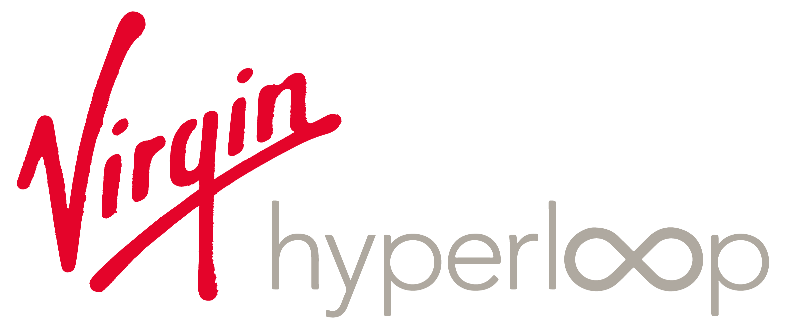
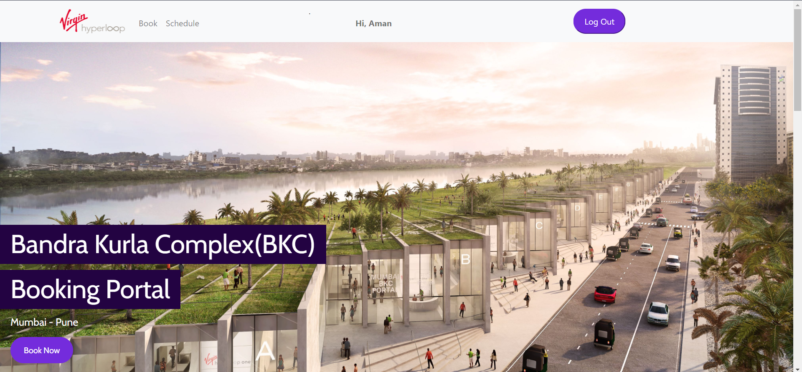

<p align='center'></p>
<h1 href = "https://hyperloop-booking.herokuapp.com/" align='center'> Bandra Kurla Portal</h1>
<p align="center"> <a target = "blank" href="https://hyperloop-booking.herokuapp.com/" > Click Here To Go The Website !</a> </p>

[Abstract](https://drive.google.com/file/d/1PyJhAWIonpMfqu3w2_we4PpdflNn0m-f/view?usp=sharing) | [Buisness Usecase](https://drive.google.com/file/d/1EdEz_vg2_M3R7Vdw0KbhK238UFHOXMXd/view?usp=sharing) | [Video](https://drive.google.com/file/d/1jK9S3-v7KcoNakoRpJx7pEvoy1bbs00_/view?usp=sharing) | [Presentation](https://drive.google.com/file/d/1ynjIjm5GW7MdZ5qVvnuSKWXXAzvFdyM-/view?usp=sharing) | [Pod Management](https://docs.google.com/spreadsheets/d/1A_P6xKZdIawmSd4zODfIMahDnlwAUfUI/edit?usp=sharing&ouid=101607307626438172474&rtpof=true&sd=true)
<p align='center'>
Virgin Hyperloop is working with the State of Maharashtra to develop a Pune to Mumbai hyperloop which will slash journey times down to 25 minutes, support 150 million passenger trips annually, and create a thriving megaregion. It would be a transformative move as it would create socio-economic benefits upwards of 36 billio USD $. The route will be a catalyst for growth as it would create new job totaling 180 thousand and the best part is, it is Environment friendly as it will reduce annual pollution by 150 thousand.<br/> <br/>
So we created an Online Portal to manage passenger flow in a hyperloop portal while maintaining targets for level of service and passenger experience. The portal is developed to maintain the smooth flow of all the passengers in and out of the Pod keeping in mind the capacity of passengers to be shipped per hour and minimizing the waiting time of the passengers on the platform. The system is designed such that the passenger will be automatically directed towards the Pod they can catch smoothly and comfortably without any rush. It also helps to keep the traffic of both the stations (ie Mumbai and Pune) distributed equally amongst all the pods, so that there is no delay in transporting passengers as well as all the passengers are transported in time.<br/> <strong>Made with ❤ by Team-HO-217531</strong>
</p>


## What is it? ⛹️‍♂️
There are two parts of this Hyperloop portal:
1. Client Side: Client register/login into the portal and can see the schedule and other relevant information and book a ticket. A mail will be received to the user which will contain the ticker and other important information.
2. Admin Side: Admin can only go to the admin side as it is a protected route, when admin enters in the admin portal he/she can see all the details of the passengers. Also a edit option is there through which admin can edit the info of the passenger if needed, the values changed will be reflected in the DB.

[](https://github.com/zepfietje/starware)

Your appreciation makes us grow and glow up. ⭐

## Team ✨

<!-- ALL-CONTRIBUTORS-LIST:START - Do not remove or modify this section -->
<!-- prettier-ignore-start -->
<!-- markdownlint-disable -->
<table>
  <tr>
    <td align="center"><a href="http://amankumar.ga/"><br /><sub><b>Aman Kumar</b></sub></a><br /><a href="" title="Tests">⚠️</a><a href="#design-kirito-236" title="Design">🎨</a><a href="" title="Code">💻</a> <a href="" title="Frontend">🖼️</a><a href="#ideas-Aniket762" title="Ideas, Planning, & Feedback">🤔</a> <a href="" title="Documentation">📖</a> <a href="#projectManagement-Aniket762" title="Project Management">📆</a></td>
    <td align="center"><a href="https://shivamdargan.gatsbyjs.io/"><br /><sub><b>Shivam Dargan</b></sub></a><br /><a href="" title="Tests">⚠️</a><a href="#infra-kirito-236" title="Infrastructure (Hosting, Build-Tools, etc)">🚇</a> <a href="" title="Code">💻</a> <a href="" title="Backend">⚙️</a></td>
    <!-- <td align="center"><a href="https://sumana.live/"><br /><sub><b>Sumana Basu</b></sub></a><br /><a href="#design-sumana2001" title="Design">🎨</a> <a href="https://github.com/Aniket762/playground/commits?author=sumana2001" title="Documentation">📖</a> <a href="https://github.com/Aniket762/playground/commits?author=sumana2001" title="Code">💻</a></td>
  </tr> -->
</table>

## Prerequisites 👨‍💻

### Install Node JS
Refer to https://nodejs.org/en/ to install nodejs

### Install create-react-app
Install create-react-app npm package globally. This will help to easily run the project and also build the source files easily. Use the following command to install create-react-app

```bash
npm install -g create-react-app
```

## Cloning and Running the Application in local 💻

Clone the project in localhost
```bash
git clone https://github.com/amankumar11/Hyperops.git
```
Install all the npm packages. Go into the web folder and type the following command to install all npm packages

```bash
npm install
```

In order to run the application in development mode type the following command

```bash
yarn dev
```

The Application Runs on **localhost:3000**

### To spin up the backend server

Navigate to the main project folder in a seperate terminal. Then install all npm packages
```bash
npm install 
```

If you don't have nodemon globally installed on your system, install it so the server can autorefresh 
```bash
npm install -g nodemon
```

Now it's time to spin up the backend server. Run the lines
```bash
npm run dev
```
If you get an error immediately, don't worry. The final step is to connect to the MongoDB database.

Note: The Server Runs on **localhost:5000**

## Connecting to the Database
Spin up your cluster in MongoDB and replace your connection with URI in `.env`
If you face any problems, refer to the [MongoDB](https://www.mongodb.com/blog/postquick-start-nodejs-mongodb--how-to-get-connected-to-your-database) website.


## Connecting to the Database if you haven't used MongoDB Atlas before
Install the MongoDB Node.js Driver with the following command:
```bash
npm install mongodb
```

Set up a [MongoDB Atlas Database](https://www.youtube.com/watch?v=rPqRyYJmx2g) by following this short MongoDB setup video till the *3:20* mark. Stop after that mark!

On your Cluster home page, select CONNECT > Connect your application. 
1. Select Node.js in the drop down for your driver, and select the latest version. 
1. Then, copy the connecting string (URI).
1. Paste this string as the value of mongoURI inside `.env` of this project.

Replace the `<password>` section of the string with your Database Access password. Viola, your server should now successfuly connect to MongoDB!
## How we built it 🧑‍💻
We used Reactjs in frontend along with React-Bootstrap library and NodeJs as backend along with Express as a Router and MongoDB as a Database. We used PassportJs for user authentication and Node-mailer to send mail to user. Whenever user books a ticket or a ticket is updated by a user Database is updated.

## Challenges we ran into 🥺
We faced numerours challenges throughout the journey. Firstly, we had to do all the maths and come to a algorithm which can transport maximum number of passengers while following the conditions given in the competition. All the ideation and algorithm part was individually done by Aman as till that point the team consisted of only one memeber, but later we added Shivam into our team to help us with backend. In the frontend the part where we need to show a schedule table was challenging for us as we can't straightly place a table as then we will need to data of around 500 lines by typing which would be very hectic and time consuming, hence we came through a solution of directly importing the PDF using react-pdf. The challenging part in backend was that we need the admin to update a particular field that is pod number, and if updated the value in the database should be updated, also we were having problems in sending mail to the user so we decided to use a library known as node-mailer to simplify the task.

## Accomplishments that we're proud of 😎
The biggest accomplishment for us was that we learned so many new things while creating either it be backend integration, Axios, Express, React-pdf, Node-Mailer etc. Our team was a single team till December mid, only Aman was there and did the whole ideation and frontend in Reactjs portion, which was a big accomplishment for us, later when we added Shivam in our team, the speed of our work escalated and we were able to complete a Full fledged, responsive portal which can be used in real time to handle passenger flow in BKC portal.

## What we learned 🤓
As we started learning MERN stack it was a perfect opportunity for us to make a full fledged portal in MERN stack and polish our skills. Along the way we even learned various libraries by implementing them in our portal such as Express, bcrypt, cookie-parser, sweetalert, Node-Mailer, React-pdf, React-bootstrap, Nodemon, Mongoose, passport etc.

## Built With 💕
- [ ] Reactjs 
- [ ] Nodejs
- [ ] Javascript
- [ ] Express
- [ ] MongoDB
- [ ] Mongoose
- [ ] CSS
- [ ] Nodemon
- [ ] Nodemailer
- [ ] Axios
- [ ] ReactBootstrap
- [ ] passportjs
- [ ] Sweetalert
- [ ] Cookieparser
- [ ] Heroku


## What's next for BKC Portal 🔥
Next, we want to increase the quality of user experience by portal automatically suggesting user the Pod Number according to the time on which he is booking. The admin portal will be updated with a log where admin can see live location of each pod. Other than this, the portal can be made an Application which can be run on mobile so that user can also book a ticket from Mobile application.


